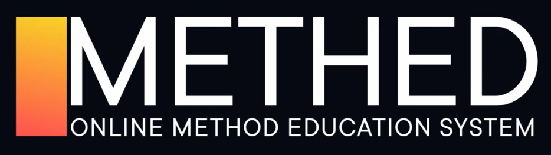

# VladilenMinin
**Webpack. Базовый курс 2022.**

Ссылка на [Youtube](https://www.youtube.com/watch?v=o8KMucDpSno).

Описание работы Webpack 5, инициализация проекта, установка необходимых пакетов, настройка конфига.

[Zip архив](learn-wp-master.zip)

Ссылка на сборку: [GitHub](https://github.com/maksim-leskin/learn-wp)

